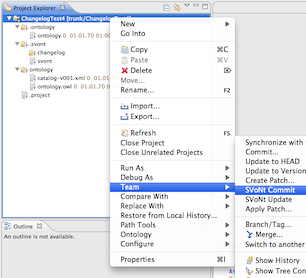

SVoNt
=====

Subversion and Eclipse plugins for semantic versioning of OWL-EL ontologies

## Usage

### Creating a SVoNt Project

Create a new project using the "New Project" wizard:

1. In any explorer view in Eclipse (e.g. Project Explorer or Java Package Explorer view), right click and select "New -> Project...".
2. In the upcoming window, select the wizard suiting the type of project you intend to create.

 
 
3. Create your ontology (using Eclipse or any external tool), and save it in your Eclipse Workspace.

 **Important!**
 * The file must be named `ontology.owl`.
 * The file must reside in a folder named `ontologies`. The folder must reside directly under the project root.
 * The serialization format of the ontology has to be RDF/XML.

 This is how things should look after the setup:

 

4. Load the project as an Ontology Project:

 
 
5. Share the project to SVN:
 
 

 Please follow the instructions given by the Subclipse sharing wizard in order to select a repository for the new project.
 
6. **Before commiting for the first time**, load the project as a SVoNt Project:

 

7. In the upcoming dialog window, enter the WebDAV URL for the SVoNt change log repository:

 

8. Perform an initial commit operation using the **SVoNt Commit** command:

 

 The regular SVN commit dialog will show. Proceed as usual.

9. In order to synchronize the newly created remote change log with the local change log, perform a **SVoNt Update** operation:

 

Finally, the project structure should look like this (the screenshot shows hidden files which should not be visible in your setup, unless you configured the explorer view to show hidden files): 

 
